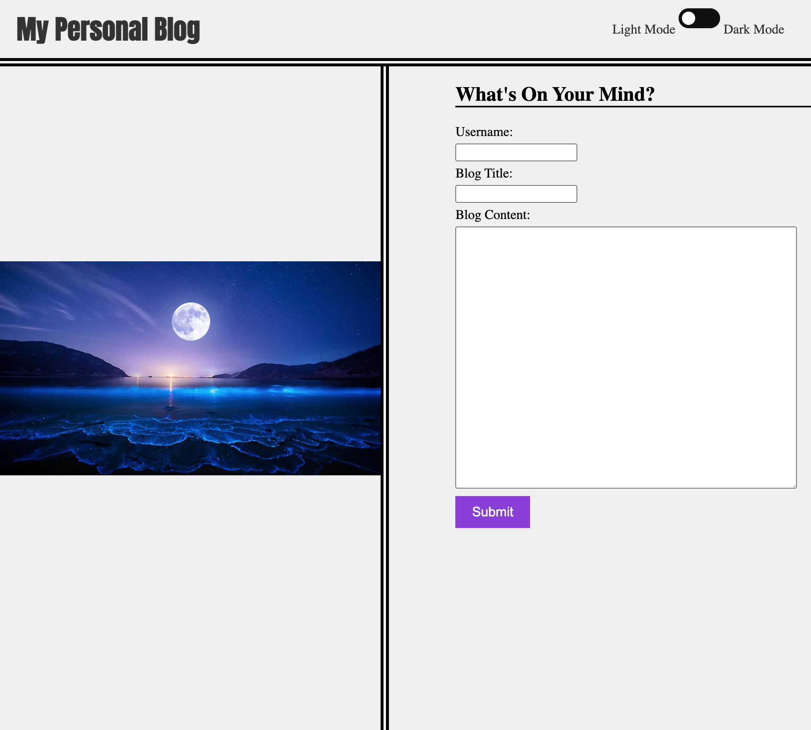
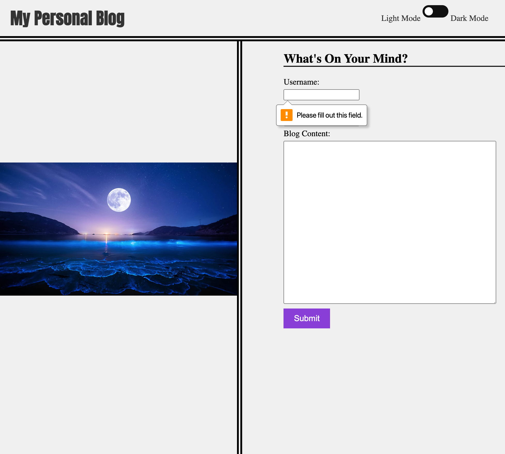
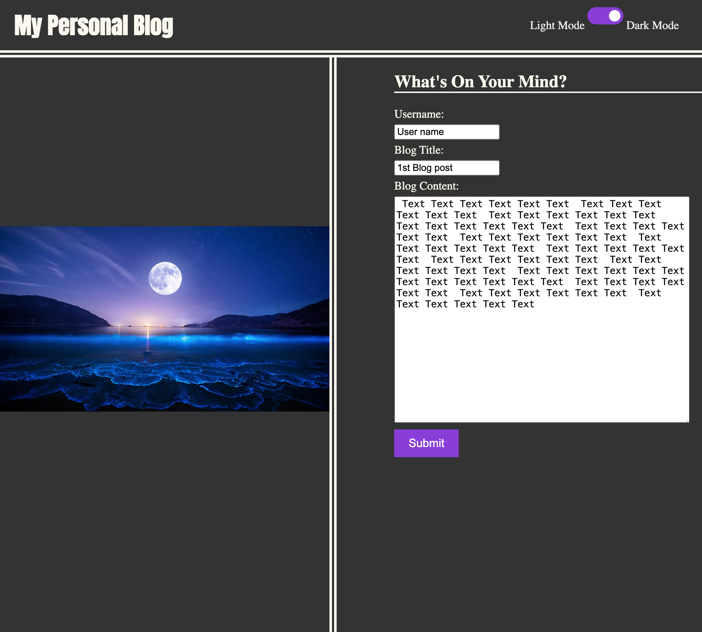
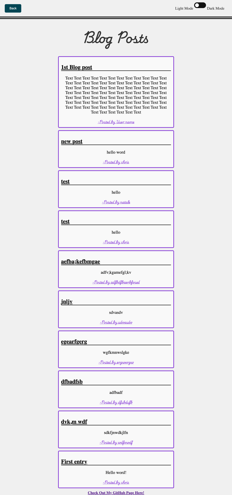
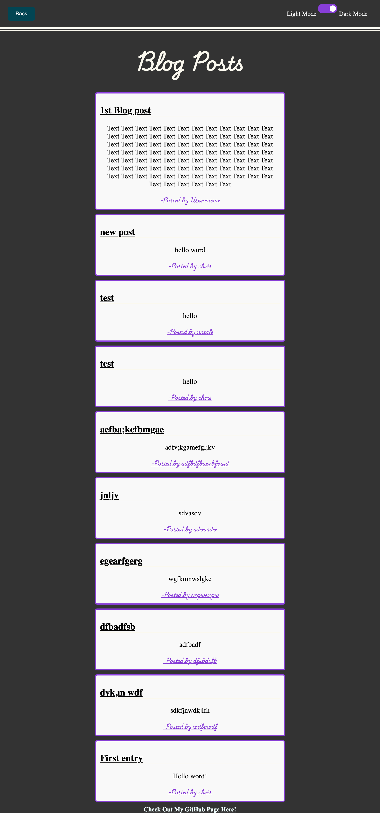

# personal-blog-web-api

# Description

- Personal blog website
- user has the option of choosing between light or dark mode using the toggle switch in the top right courner
- all fields in the index.HTML have a required action using JavaScript to ensure all fields are filled out
- When the user clicks "submit", all input values are saved to the blogPost array in localStorage, which will also contain previous submitted values
- When user clicks "submit", browser with direct user to secound page, blog.html, which outputs the current blog post and any previous ones that have been saved to localStorage in reverse order from most recent. 
- User can also toggle between light and dark mode is also on the blog page
- Footer contains link to creators GitHub page

# applications used to build blog pages

- HTML
- JavaScript
- CSS 

# Tasks Completed

- Created an blog submission and blog page with HTML and styled with CSS
- Enabled ligh/dark mode toggle switch for user to choose how the screen looks. This feature will save choosen option when page is refreshed
- Once user clicks submit in blog entry page, Javascript is used to save input values in localStorage and will redirect user to the Blog.html. This page will load new and already excisting blog entries in reverse order from newest entry to oldest.
- when user clicks the back button, they will be redirected to the index.html page and can submit more blog entries. 

# Usage

- Screenshots of Webpages:

- [Link to Personal Blog Site ](https://natale565.github.io/personal-blog-web-api/)
